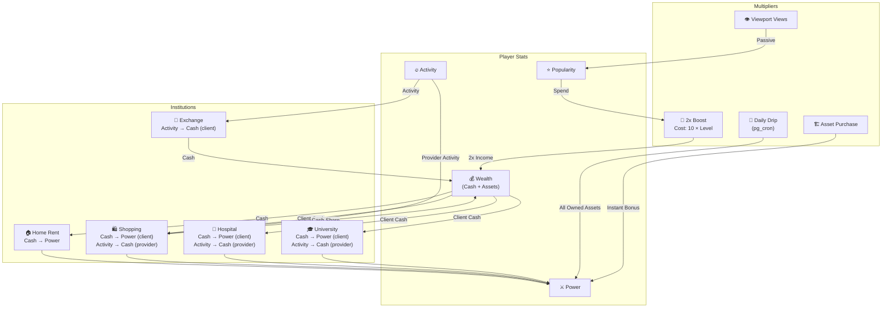

# 4-Factor Economy System — Implementation Plan (v2)

The game economy revolves around 4 core stats: **Power** (⚔️), **Wealth** (💰), **Activity** (🔥), **Popularity** (⭐). In-game **institutions** are the conversion engines — each institution type has a unique conversion definition that transforms some stats into others.

## Resolved Design Decisions

| Decision | Resolution |
|---|---|
| View counting | **Passive viewport rendering (option B)** — frictionless |
| Service cooldowns | **Not now** — future sprint |
| Exchange architecture | **Exchange is an institution like any other** — its unique conversion is Activity → Cash |

### ⚔️ Power Tiers — 6-Tier Progression

| Tier | Name (Farsi) | Power Range | XP to Advance |
|---|---|---|---|
| 1 | تازه‌کار (Rookie) | 0 – 20 | 100 XP |
| 2 | شهروند (Citizen) | 21 – 50 | 500 XP |
| 3 | استاندار (Governor) | 51 – 150 | 2,000 XP |
| 4 | فرماندار (Commander) | 151 – 500 | 10,000 XP |
| 5 | سلطان (Sultan) | 501 – 2,000 | 50,000 XP |
| 6 | شاهنشاه (Emperor) | 2,001+ | ∞ |

XP gaps grow **~5× per tier** to sustain long-term engagement. Power within a tier grows from asset ownership, services, and daily drip — not directly from XP. XP is the *unlock* gate to enter the next tier.

### 🏦 Exchange Rates

The exchange institution converts Activity → Cash. Rate depends on whether the player owns a business:

| Player Situation | Activity → Cash Rate |
|---|---|
| No business owned | **1 activity = 2 cash** (lazy tax) |
| Owns a business (same category) | **1 activity = 3.5 cash** (owner bonus) |
| Has an established business (runs it actively) | **1 activity = 5 cash** (full business rate) |

> "Established" = business asset with `level >= 2` and used within the last 7 days.

### 🚀 Popularity Boost — 2× Income

- **Cost:** `10 × business_level` popularity points
- **Duration:** **24 hours** from activation
- **Effect:** All income generated by that asset is doubled during the active window
- **Stacking:** Cannot stack — a new boost replaces the remaining time
- **Example:** Level 3 shopping mall costs 30 popularity for 24h of 2× income

### 📅 Daily Power Drip — pg_cron

- Runs **server-side via Supabase pg_cron at midnight UTC daily**
- Each owned asset contributes `daily_power_drip` points to its owner's power
- Power drip rates by asset type (per day):

| Asset Type | Power Drip/Day |
|---|---|
| house / home | +1 |
| shop / market | +2 |
| mall | +3 |
| office | +2 |
| farm | +1 |
| warehouse | +1 |
| villa | +2 |
| tower | +5 |
| barracks | +8 |
| custom (approved) | configurable in `custom_settings` |

## Unified Institution Model

Every institution (building type with a service) is defined by a **conversion formula**:

| Institution Type | Client Pays | Client Gets | Provider Pays | Provider Gets |
|---|---|---|---|---|
| 🏠 `home_rent` | Cash | Power | — | — |
| 🛍️ `shopping` | Cash | Power | Activity | Cash (% share) |
| 🏥 `hospital` | Cash | Power | Activity | Cash (% share) |
| 🎓 `university` | Cash | Power | Activity | Cash (% share) |
| ☕ `cafe` | Cash | Power | Activity | Cash (% share) |
| 🏋️ `gym` | Cash | Power | Activity | Cash (% share) |
| 📚 `library` | Cash | Power | Activity | Cash (% share) |
| 🏦 `exchange` | Activity | Cash | — | — |

> The provider side only exists for player-owned businesses. `home_rent` and `exchange` have no provider (or the system is the provider).

---

## Proposed Changes

### 1. Economy Constants

#### [MODIFY] [constants.ts](file:///c:/Users/Hamidrexa/HackerSpace/Buildstack/buildiran/src/lib/constants.ts)

Add economy tuning constants:

- **`POWER_TIERS`** — array of 6 tier objects `{ tier, nameFa, minPower, maxPower, xpRequired }` matching the table above
- **`INSTITUTION_DEFINITIONS`** — unified config map keyed by institution code:
  - `clientCost: { stat: 'cash'|'activity', amount: number }`
  - `clientGain: { stat: 'power'|'cash', amount: number }`
  - `providerCost?: { stat: 'activity', amount: number }`
  - `providerGain?: { stat: 'cash', percent: number }` (% share of client cash paid)
- **`EXCHANGE_RATES`** — `{ base: 2, ownerBonus: 3.5, establishedBusiness: 5 }`
- **`DAILY_POWER_DRIP`** — `Record<BuildingType, number>` matching the drip table above
- **`POPULARITY_BOOST_BASE_COST = 10`** — multiplied by `asset.level` at activation time
- **`POPULARITY_BOOST_DURATION_HOURS = 24`** — flat 24h window
- **`POPULARITY_BOOST_MULTIPLIER = 2`** — the income multiplier (2×)
- **`POPULARITY_PER_VIEW = 1`** — popularity granted to owner per unique daily viewport view
- **`ACTIVITY_EVENTS`** — map of user action → activity points awarded

---

### 2. Supabase Schema Migration

#### [NEW] [economy_migration.sql](file:///c:/Users/Hamidrexa/HackerSpace/Buildstack/buildiran/economy_migration.sql)

Separate migration file (also appended to main schema for reference).

**New columns on `profiles`:**
- `power_tier INTEGER DEFAULT 1`
- `power_xp INTEGER DEFAULT 0`
- `activity_last_reset TIMESTAMPTZ DEFAULT NOW()`

**New columns on `assets`:**
- `income_rate BIGINT DEFAULT 0`
- `total_views INTEGER DEFAULT 0`
- `daily_power_drip INTEGER DEFAULT 0`
- `institution_type TEXT` — nullable, one of the institution codes

**New table: `asset_views`** — passive viewport views:
```sql
CREATE TABLE public.asset_views (
  id UUID PRIMARY KEY DEFAULT gen_random_uuid(),
  asset_id UUID NOT NULL REFERENCES public.assets(id) ON DELETE CASCADE,
  viewer_id UUID NOT NULL REFERENCES public.profiles(id) ON DELETE CASCADE,
  owner_id UUID NOT NULL REFERENCES public.profiles(id) ON DELETE CASCADE,
  viewed_at TIMESTAMPTZ DEFAULT NOW(),
  UNIQUE(asset_id, viewer_id, (viewed_at::date))
);
```

**New table: `service_transactions`** — logs all institution usage:
```sql
CREATE TABLE public.service_transactions (
  id UUID PRIMARY KEY DEFAULT gen_random_uuid(),
  business_asset_id UUID NOT NULL REFERENCES public.assets(id) ON DELETE CASCADE,
  provider_id UUID NOT NULL REFERENCES public.profiles(id),
  client_id UUID NOT NULL REFERENCES public.profiles(id),
  institution_type TEXT NOT NULL,
  client_cost_stat TEXT NOT NULL,     -- 'cash' or 'activity'
  client_cost_amount BIGINT NOT NULL DEFAULT 0,
  client_gain_stat TEXT NOT NULL,     -- 'power' or 'cash'
  client_gain_amount BIGINT NOT NULL DEFAULT 0,
  provider_activity_spent INTEGER NOT NULL DEFAULT 0,
  provider_cash_earned BIGINT NOT NULL DEFAULT 0,
  created_at TIMESTAMPTZ DEFAULT NOW()
);
```

**New table: `popularity_boosts`:**
```sql
CREATE TABLE public.popularity_boosts (
  id UUID PRIMARY KEY DEFAULT gen_random_uuid(),
  asset_id UUID NOT NULL REFERENCES public.assets(id) ON DELETE CASCADE,
  owner_id UUID NOT NULL REFERENCES public.profiles(id),
  popularity_spent INTEGER NOT NULL,
  asset_level INTEGER NOT NULL DEFAULT 1,
  activated_at TIMESTAMPTZ DEFAULT NOW(),
  expires_at TIMESTAMPTZ NOT NULL
);
```

**New RPC functions:**
1. `use_institution(p_asset_id, p_institution_type)` — atomic: deduct client cost, grant client gain, deduct provider activity, grant provider cash share
2. `record_asset_views(p_views JSONB)` — batch-insert viewport views + increment owner popularity (called with array of `{asset_id, viewer_id, owner_id}`)
3. `activate_popularity_boost(p_asset_id)` — spend `10 × asset.level` popularity, create boost record
4. `collect_daily_power()` — pg_cron job: for each player, sum `daily_power_drip` of all owned assets, add to player power, advance tier if XP met
5. `reset_daily_activity()` — pg_cron job: reset activity to 0 daily

**pg_cron schedules:**
```sql
SELECT cron.schedule('daily-power-drip', '0 0 * * *', $$SELECT public.collect_daily_power()$$);
SELECT cron.schedule('daily-activity-reset', '0 0 * * *', $$SELECT public.reset_daily_activity()$$);
```

---

### 3. TypeScript Types

#### [MODIFY] [game.types.ts](file:///c:/Users/Hamidrexa/HackerSpace/Buildstack/buildiran/src/types/game.types.ts)

- `PowerTier` — `{ tier, nameFa, minPower, maxPower, xpRequired }`
- `InstitutionType` — union of all institution codes
- `InstitutionDefinition` — conversion formula interface
- `ServiceTransaction`, `AssetView`, `PopularityBoost` interfaces
- Extend `Asset` with `incomeRate`, `totalViews`, `dailyPowerDrip`, `institutionType`
- Extend `Player` with `powerTier`, `powerXp`
- `EngagementData` — aggregated view/popularity data for dashboard

---

### 4. Economy Store

#### [NEW] [useEconomyStore.ts](file:///c:/Users/Hamidrexa/HackerSpace/Buildstack/buildiran/src/store/useEconomyStore.ts)

Central store for all economy operations:
- `useInstitution(assetId)` — calls `use_institution` RPC
- `recordViewportViews(visibleAssets[])` — batched viewport view tracking
- `activateBoost(assetId)` — calls `activate_popularity_boost` RPC
- `fetchEngagement(assetId)` — loads engagement dashboard data
- `fetchActiveBoosts(playerId)` — loads active boosts
- `getPlayerTier(power)` — utility to resolve tier
- `getBoostCost(assetLevel)` — returns `10 × level`

---

### 5. Update Existing Stores

#### [MODIFY] [usePlayerStore.ts](file:///c:/Users/Hamidrexa/HackerSpace/Buildstack/buildiran/src/store/usePlayerStore.ts)

- Update `dbRowToPlayer` with `powerTier`, `powerXp`
- Add `incrementActivity(points)` action
- Update `syncToSupabase` to include new fields

#### [MODIFY] [useAssetStore.ts](file:///c:/Users/Hamidrexa/HackerSpace/Buildstack/buildiran/src/store/useAssetStore.ts)

- Update `dbRowToAsset` with `incomeRate`, `totalViews`, `dailyPowerDrip`, `institutionType`
- Extend `BUILDING_CONFIG` with `incomeRate`, `dailyPowerDrip`, `institutionType`
- On `buildAsset`: grant instant power bonus at purchase

---

### 6. Viewport View Tracking Hook

#### [NEW] [useViewportTracker.ts](file:///c:/Users/Hamidrexa/HackerSpace/Buildstack/buildiran/src/hooks/useViewportTracker.ts)

Debounced hook that:
- Listens to map viewport changes
- Identifies which other-player assets are currently visible
- Every ~5 seconds, batches and sends unique `{asset_id, viewer_id}` pairs to `record_asset_views` RPC
- Deduplicates to avoid spamming (per-session memory of already-viewed assets)

#### [NEW] [useActivityTracker.ts](file:///c:/Users/Hamidrexa/HackerSpace/Buildstack/buildiran/src/hooks/useActivityTracker.ts)

Simple hook for tracking manual activity events:
- `trackActivity(event, points)` — increments activity in Supabase + local store
- Called from existing components at interaction points (build, trade, upgrade, etc.)

---

### 7. Institution UI Components

#### [NEW] [InstitutionServiceModal.tsx](file:///c:/Users/Hamidrexa/HackerSpace/Buildstack/buildiran/src/components/game/InstitutionServiceModal.tsx)

Unified modal for all institution interactions (client-side):
- Dynamically renders based on `institutionType` of the tapped asset
- Shows: institution icon, name, conversion formula in plain Farsi, cost, gain preview
- "استفاده از خدمات" button
- Sound + animation feedback

#### [NEW] [PopularityBoostModal.tsx](file:///c:/Users/Hamidrexa/HackerSpace/Buildstack/buildiran/src/components/game/PopularityBoostModal.tsx)

For business owners to activate 2x income:
- Shows cost (10 × level), current popularity, duration
- Active boost countdown if already active
- "فعال‌سازی تقویت درآمد" button

#### [NEW] [EngagementDashboard.tsx](file:///c:/Users/Hamidrexa/HackerSpace/Buildstack/buildiran/src/components/game/EngagementDashboard.tsx)

Asset owner's analytics view:
- Total views (today / week / all-time)
- Popularity earned from views
- Viewer list
- Upgrade suggestions

---

### 8. Wire Into Existing Components

#### [MODIFY] [AssetDetailModal.tsx](file:///c:/Users/Hamidrexa/HackerSpace/Buildstack/buildiran/src/components/game/AssetDetailModal.tsx)

- If asset has `institutionType` and viewer is not owner → show "Use Service" button → opens `InstitutionServiceModal`
- If viewer is owner → show "Engagement Dashboard" + "Boost" buttons
- If viewer is owner and asset is a business → show provider stats (activity cost, cash earned)

#### [MODIFY] [HUD.tsx](file:///c:/Users/Hamidrexa/HackerSpace/Buildstack/buildiran/src/components/game/HUD.tsx)

- Show power tier badge (e.g., "شهروند ⚔️") next to power stat
- Show 🔥2x indicator if any owned asset has active boost

#### [MODIFY] [index.tsx (map)](file:///c:/Users/Hamidrexa/HackerSpace/Buildstack/buildiran/src/app/(game)/index.tsx)

- Mount `useViewportTracker` hook for passive view tracking
- Track `tile_load` activity

#### [MODIFY] [marketplace.tsx](file:///c:/Users/Hamidrexa/HackerSpace/Buildstack/buildiran/src/app/(game)/marketplace.tsx)

- Track `marketplace_view` activity on mount

---

### 9. i18n

#### [MODIFY] [fa.ts](file:///c:/Users/Hamidrexa/HackerSpace/Buildstack/buildiran/src/i18n/fa.ts)

Add `economy` section with all institution, exchange, boost, tier, and engagement strings in Farsi.

---

## Economy Flow Diagram



---

## Verification Plan

### Automated Tests
```bash
npx tsc --noEmit
npx expo export --platform web
```

### Manual Verification
- Use institution service → verify cash/power/activity flows
- Viewport scroll → verify passive view recording → popularity grants
- Activate popularity boost (scaled cost) → verify 2x income
- Wait for pg_cron daily tick → verify power drip
- Check engagement dashboard data accuracy
- All Farsi strings render RTL correctly
