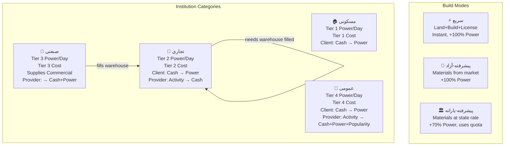

# Build Modes & Institution Type System — Implementation Plan (v3 — Revised)

## Overview

Two major feature additions on top of the existing economy system (v2):

1. **Dual Build Modes** — Fast (pay premium, instant) vs. Advanced (tap-to-add material gathering from nearby player shops or subsidized state)
2. **4-Type Institution Classification** — Residential / Commercial / Industrial / Public, each with distinct power-day tiers, cash tiers, client/provider economy roles

---

## User Review Required

> [!WARNING]
> **Schema migration required** — The new file `build_modes_v1_migration.sql` must be run after `Supabase Schema.sql` AND `economy_migration.sql`. It adds new columns, tables, and RPCs without duplicating any existing constraint.

> [!IMPORTANT]
> **Warehouse supply chain** — Large Commercial buildings (mall, restaurant, etc.) require their linked warehouse to be filled by an Industrial provider before clients can use the service. The `fill_warehouse` RPC is new. Confirm whether the link between Industrial and Commercial is free-choice (any farm can fill any warehouse) or location-constrained (proximity radius).

---

## Resolved Clarifications

| Topic | Resolution |
|---|---|
| Advanced mode UX | **Tap-to-add** per material item from a scrollable list |
| Subsidy quota | **5,000 units/week**, resets Monday 00:00 UTC — confirmed |
| License requirement | Both **Fast AND Advanced** modes require a license for Commercial + Industrial |
| License cost formula | Per-building function of `dailyPowerDrip × categoryMultiplier + (clientCashPerUse × categoryFee)` — see table |
| Advanced mode cost | Determined **per item** — items priced by nearby player shops (free market) or state subsidy rate (fixed, uses quota) |
| Power bonus source | **Free-market items → 100% power**, **subsidized items → 70% power** — computed as weighted average of gathered basket |
| Fast mode "random items" | Fast mode internally uses a system-computed baseline; no player choice; cost is fixed and higher |
| Industrial provider gain | Cash share % **+ power bonus per interaction** (e.g., farm: +2 power per warehouse fill) |
| Public provider gain | Activity cost → Cash + Power + **Popularity** |
| Nearby shop items | Advanced mode fetches `assets` within N meters that are active Commercial buildings and shows their item catalog |

---

## Design Summary

### Build Modes

| Mode | Land | Construction | License (biz) | Time | Power Bonus |
|---|---|---|---|---|---|
| Fast | ✅ Included | ✅ Included | ✅ Required | Instant | 100% (baseline) |
| Advanced (free market) | ✅ Separate | Tap items from nearby shops | ✅ Required | Tap-to-add | 100% of gathered items |
| Advanced (subsidized) | ✅ Separate | Items at state rate | ✅ Required | Tap-to-add | 70% of gathered items |

### License Cost Formula

License is a one-time payment per building, calculated at build time:

```
licenseFee = floor(
  asset.dailyPowerDrip × CATEGORY_POWER_LICENSE_RATE[category]
  + institutionDef.clientCostPerUse × CATEGORY_CASH_LICENSE_RATE[category]
)
```

| Category | `CATEGORY_POWER_LICENSE_RATE` | `CATEGORY_CASH_LICENSE_RATE` |
|---|---|---|
| Residential | 0 (no license) | 0 |
| Commercial | 50 | 0.5 |
| Industrial | 80 | 0.3 |
| Public | 100 | 0.2 |

### Full Client/Provider Matrix by Institution Category

| Category | Institution Example | Client Pays | Client Gets | Provider Pays | Provider Gets |
|---|---|---|---|---|---|
| **Residential** | home_rent | Cash | Power | — | — |
| **Commercial (basic)** | cafe, gym, shopping | Cash | Power | Activity | Cash (% share) |
| **Commercial (library)** | library | Cash + Activity | Power (higher) | Activity | Cash (% share) |
| **Commercial (exchange)** | exchange | Activity | Cash | — | — |
| **Commercial (big)** | mall, restaurant | Cash | Power | Activity | Cash (% share), **requires warehouse filled** |
| **Industrial** | farm, factory | — (no client) | — | Fills warehouse | Cash + **Power** |
| **Public** | hospital, university, bank, park | Cash | Power | Activity | Cash (% share) + **Power** + **Popularity** |

> Residential buildings have **no institution service** — power comes only from the daily drip and the build bonus.

### Power Drip by Building Type (updated, by tier)

| Building (Farsi) | Category | Power/Day | Build Cost Tier |
|---|---|---|---|
| house — خانه | Residential | **+1** | T1 (500) |
| villa — ویلا | Residential | **+2** | T1 (3,500) |
| tower — برج | Residential | **+5** | T1 (8,000) |
| shop — مغازه | Commercial | **+2** | T2 (1,200) |
| cafe — کافه | Commercial | **+2** | T2 (1,500) |
| gym — باشگاه | Commercial | **+2** | T2 (1,800) |
| warehouse — انبار | Commercial | **+1** | T2 (1,000) |
| exchange — بورس | Commercial | **+2** | T2 (2,500) |
| mall — مرکز خرید | Commercial | **+3** | T2 (5,000) |
| restaurant — رستوران | Commercial | **+2** | T2 (2,000) |
| farm — مزرعه | Industrial | **+3** | T3 (2,000) |
| factory — کارخانه | Industrial | **+4** | T3 (6,000) |
| hospital — بیمارستان | Public | **+4** | T4 (8,000) |
| park — پارک | Public | **+2** | T4 (3,000) |
| university — دانشگاه | Public | **+4** | T4 (10,000) |
| bank — بانک | Public | **+3** | T4 (5,000) |

### Subsidy System

- `profiles.subsidy_quota` — integer, resets weekly to `5000` (confirmed)
- Subsidy applies **per material item**, not per build as a whole — player can mix subsidized and market items freely
- Each subsidized item consumes `item.subsidyQuotaCost` units from the player's quota
- Power bonus is computed as a weighted average: `(marketItems × 1.0 + subsidizedItems × 0.7) / totalItems × basePowerBonus`
- `pg_cron` weekly reset: Monday 00:00 UTC

### Advanced Mode: Nearby Shop Item Discovery

- When entering Advanced mode, the client queries `assets` within **500 m** of the build coordinate
- Filters to Commercial assets with `warehouse_filled = true` and `institution_type IN ('shopping', 'cafe', 'restaurant', ...)`
- Each such shop has a `market_items` JSONB column listing `{ itemId, nameFa, price, stock }` set by the shop owner
- Items from the player's own shops are excluded (can't self-supply for power bonus purposes)
- If no nearby shop has the required item, the player must use state subsidy or wait
- Free-market item purchase calls `buy_build_material` RPC → deducts cash from buyer, adds cash to shop owner

---

## Proposed Changes

### 1. Types

#### [MODIFY] [`game.types.ts`](file:///c:/Users/Hamidrexa/HackerSpace/Buildstack/buildiran/src/types/game.types.ts)

- Add `InstitutionCategory = 'residential' | 'commercial' | 'industrial' | 'public'`
- Update `StandardBuildingType` union with: `'restaurant' | 'gym' | 'cafe' | 'factory' | 'hospital' | 'park' | 'university' | 'bank'`
- Add `BuildMode = 'fast' | 'advanced'`
- Add `MaterialSource = 'market' | 'subsidized'`
- Add `NearbyShopItem { shopAssetId, shopOwnerUsername, itemId, nameFa, price, stock }` — market item from a nearby player shop
- Add `BuildMaterialSlot { slotId, nameFa, required: true, gathered: BuildMaterialGather | null }` — one required material for a build
- Add `BuildMaterialGather { source: MaterialSource, shopAssetId?: string, unitCost, qty, powerRatio }` — gathered item fill
- Add `AdvancedBuildSession { sessionId, buildingType, slots: BuildMaterialSlot[], totalCashCost, totalQuotaUsed, effectivePowerRatio, allGathered: boolean }`
- Extend `Player` with `subsidyQuota: number`
- Extend `Asset` with `buildMode: BuildMode`, `institutionCategory: InstitutionCategory | null`, `licensePurchased: boolean`, `warehouseFilled: boolean`, `marketItems: NearbyShopItem[]` (local cache, not DB)
- Extend `InstitutionDefinition` with:
  - `category: InstitutionCategory`
  - `providerGainPower?: number` — power earned by provider (Industrial + Public)
  - `providerGainPopularity?: number` — popularity earned by provider (Public only)
  - `requiresWarehouseFill?: boolean` — needs linked Industrial fill to activate
  - `licenseRequired: boolean` — true for Commercial + Industrial

---

### 2. Constants

#### [MODIFY] [`constants.ts`](file:///c:/Users/Hamidrexa/HackerSpace/Buildstack/buildiran/src/lib/constants.ts)

**New constants to add:**

```typescript
// Build Modes
export const BUILD_MODE_FAST_COST_MULTIPLIER = 1.0;   // base price
export const BUILD_MODE_ADVANCED_COST_RATIO  = 0.60;  // 60% of fast
export const BUILD_MODE_SUBSIDIZED_COST_RATIO = 0.40; // 40% of fast

// Power bonus ratio when using subsidized materials
export const SUBSIDIZED_POWER_RATIO = 0.70;

// Default weekly subsidy quota per player
export const SUBSIDY_QUOTA_DEFAULT  = 5000;

// Business license flat fees (Fast mode only, one per building)
export const LICENSE_FEE: Record<InstitutionCategory, number> = {
  residential: 0,
  commercial:  500,
  industrial:  800,
  public:      1000,
};

// Advanced build materials catalog
export const BUILD_MATERIALS = [ ... ]; // cement, steel, brick, glass, wood, etc.

// Institution category per building type
export const INSTITUTION_CATEGORY: Record<string, InstitutionCategory> = {
  house: 'residential',  tower: 'residential',  villa: 'residential',
  shop: 'commercial',    mall: 'commercial',     exchange: 'commercial',
  gym: 'commercial',     cafe: 'commercial',     restaurant: 'commercial',
  warehouse: 'commercial',
  farm: 'industrial',    factory: 'industrial',
  hospital: 'public',    park: 'public',
  university: 'public',  bank: 'public',
};
```

**Update `INSTITUTION_DEFINITIONS`** — add `category`, `providerGainPower`, `providerGainPopularity`, `requiresWarehouse`, `licenseRequired` to each entry.

**Update `BUILDING_CONFIG`** in `useAssetStore.ts` — add new building types (restaurant, gym, cafe, factory, hospital, park, university, bank) with properly tiered costs and power drip.

**Update `DAILY_POWER_DRIP`** — add all new building types per the table above.

---

### 3. Supabase Schema Migration

#### [NEW] [`build_modes_migration.sql`](file:///c:/Users/Hamidrexa/HackerSpace/Buildstack/buildiran/build_modes_migration.sql)

```sql
-- === profiles additions ===
ALTER TABLE public.profiles
  ADD COLUMN IF NOT EXISTS subsidy_quota   INTEGER DEFAULT 5000,
  ADD COLUMN IF NOT EXISTS subsidy_reset_at TIMESTAMPTZ DEFAULT NOW();

-- === assets additions ===
ALTER TABLE public.assets
  ADD COLUMN IF NOT EXISTS build_mode       TEXT DEFAULT 'fast',   -- 'fast'|'advanced'
  ADD COLUMN IF NOT EXISTS institution_category TEXT,              -- 'residential'|'commercial'|'industrial'|'public'
  ADD COLUMN IF NOT EXISTS license_purchased BOOLEAN DEFAULT FALSE,
  ADD COLUMN IF NOT EXISTS warehouse_filled BOOLEAN DEFAULT FALSE; -- for Commercial with warehouse req

-- === New table: build_material_sessions ===
-- Tracks an in-progress Advanced mode build before confirmation
CREATE TABLE IF NOT EXISTS public.build_material_sessions (
  id             UUID PRIMARY KEY DEFAULT gen_random_uuid(),
  player_id      UUID NOT NULL REFERENCES public.profiles(id) ON DELETE CASCADE,
  building_type  TEXT NOT NULL,
  latitude       DOUBLE PRECISION NOT NULL,
  longitude      DOUBLE PRECISION NOT NULL,
  tile_id        TEXT NOT NULL,
  materials      JSONB NOT NULL DEFAULT '[]',  -- BuildMaterialItem[]
  quota_used     INTEGER NOT NULL DEFAULT 0,
  created_at     TIMESTAMPTZ DEFAULT NOW(),
  expires_at     TIMESTAMPTZ DEFAULT NOW() + INTERVAL '2 hours'
);

-- === RPC: use_subsidy(player_id, quota_amount) ===
CREATE OR REPLACE FUNCTION public.use_subsidy(
  p_player_id UUID,
  p_quota     INTEGER
) RETURNS BOOLEAN LANGUAGE plpgsql SECURITY DEFINER AS $$
DECLARE
  current_quota INTEGER;
BEGIN
  SELECT subsidy_quota INTO current_quota FROM public.profiles
    WHERE id = p_player_id FOR UPDATE;
  IF current_quota < p_quota THEN RETURN FALSE; END IF;
  UPDATE public.profiles
    SET subsidy_quota = subsidy_quota - p_quota
    WHERE id = p_player_id;
  RETURN TRUE;
END;
$$;

-- === RPC: confirm_advanced_build(session_id) ===
-- Validates session, deducts costs, inserts asset, returns asset row
CREATE OR REPLACE FUNCTION public.confirm_advanced_build(
  p_session_id UUID
) RETURNS JSONB LANGUAGE plpgsql SECURITY DEFINER AS $$
-- implementation: validate session ownership, apply costs,
-- insert into assets with build_mode='advanced', return new asset
$$ ;

-- === pg_cron: weekly subsidy reset (Monday 00:00 UTC) ===
SELECT cron.schedule(
  'weekly-subsidy-reset',
  '0 0 * * 1',
  $$ UPDATE public.profiles
     SET subsidy_quota = 5000, subsidy_reset_at = NOW()
     WHERE subsidy_quota < 5000; $$
);
```

---

### 4. Stores

#### [MODIFY] [`useAssetStore.ts`](file:///c:/Users/Hamidrexa/HackerSpace/Buildstack/buildiran/src/store/useAssetStore.ts)

- Expand `BUILDING_CONFIG` with all new institution types
- Add `buildAssetFast(params)` — existing `buildAsset` becomes the fast path; also deducts license fee for commercial/industrial
- Add `startAdvancedBuild(params)` → creates a `build_material_sessions` row, returns session ID
- Add `addMaterialToSession(sessionId, materialId, qty, source)` → calls `use_subsidy` RPC if subsidized; appends to session's JSONB
- Add `confirmAdvancedBuild(sessionId)` → calls `confirm_advanced_build` RPC, returns asset
- Add `cancelAdvancedBuild(sessionId)` → deletes session row (refunds quota via RPC)
- Add `dbRowToAsset` field for `buildMode`, `institutionCategory`, `licensePurchased`, `warehouseFilled`

#### [MODIFY] [`usePlayerStore.ts`](file:///c:/Users/Hamidrexa/HackerSpace/Buildstack/buildiran/src/store/usePlayerStore.ts)

- Extend `dbRowToPlayer` with `subsidyQuota: row.subsidy_quota ?? 5000`
- Add `useSubsidy(amount: number): boolean` action — optimistic decrement + Supabase update
- Add `Player.subsidyQuota` to `syncToSupabase`

---

### 5. UI Components

#### [MODIFY] [`BuildModal.tsx`](file:///c:/Users/Hamidrexa/HackerSpace/Buildstack/buildiran/src/components/game/BuildModal.tsx)

The biggest UI change. Restructure into a **3-step flow**:

**Step 1 — Select Building Type** (existing grid, grouped by institution category with headers: مسکونی / تجاری / صنعتی / عمومی)

**Step 2 — Choose Build Mode**
- Two large cards: **⚡ سریع** vs **🔨 پیشرفته**
- Fast card: shows total cost breakdown (land + construction + license if needed), one-tap build
- Advanced card: shows material list, subsidy quota bar, "gather materials" CTA

**Step 3a — Fast Build Confirmation** (simple confirm dialog, same as current)

**Step 3b — Advanced Build: Material Gathering Screen**
- Full-screen modal step
- Scrollable list of required materials
- Each material row: name, quantity needed, two source buttons: 💵 بازار آزاد / 🏛️ یارانه دولتی
- Running total: cash cost + quota cost + estimated power bonus (showing premium vs subsidized ratio)
- Progress bar: "X of Y materials gathered"
- "تأیید و ساخت" button active only when all materials gathered

#### [NEW] [`BuildModeCard.tsx`](file:///c:/Users/Hamidrexa/HackerSpace/Buildstack/buildiran/src/components/game/BuildModeCard.tsx)

Reusable card for Fast / Advanced mode selection. Shows:
- Mode icon + title
- Cost summary
- Time indicator (فوری / دستی)
- If advanced: subsidy quota usage preview

#### [NEW] [`AdvancedBuildMaterialsSheet.tsx`](file:///c:/Users/Hamidrexa/HackerSpace/Buildstack/buildiran/src/components/game/AdvancedBuildMaterialsSheet.tsx)

The material gathering step UI. Handles:
- Real-time quota bar (with animation)
- Source toggle per material (free market / subsidized)
- Total cost calculation
- Submit → `confirmAdvancedBuild`

---

### 6. Updated Institution Definitions (Commercial warehouse system)

In `constants.ts`, commercial buildings that `requiresWarehouse: true` will have a new `warehouseCheck` flag checked at service time in `useEconomyStore.useInstitution`. If `asset.warehouseFilled === false`, the service is unavailable and shows a "انبار خالی است" message in `InstitutionServiceModal`.

Industrial providers (farm, factory) can "fill" a linked commercial warehouse via a new RPC `fill_warehouse(p_industrial_asset_id, p_commercial_asset_id)`, which:
1. Sets `assets.warehouse_filled = true` on the commercial asset
2. Awards the Industrial provider: cash + power

---

### 7. i18n

#### [MODIFY] [`fa.ts`](file:///c:/Users/Hamidrexa/HackerSpace/Buildstack/buildiran/src/i18n/fa.ts)

Add `build` section:

```typescript
build: {
  modeSelect: 'انتخاب روش ساخت',
  modeFast: 'سریع',
  modeAdvanced: 'پیشرفته',
  modeFastDesc: 'پرداخت فوری زمین، ساخت و مجوز — بدون انتظار',
  modeAdvancedDesc: 'جمع‌آوری مصالح از بازار یا یارانه دولتی',
  materialGather: 'تهیه مصالح',
  sourceMarket: 'بازار آزاد',
  sourceSubsidized: 'یارانه دولتی',
  subsidyQuota: 'سهمیه یارانه',
  subsidyQuotaReset: 'بازنشینی هفتگی',
  licenseRequired: 'مجوز کسب‌وکار لازم است',
  licenseFee: 'هزینه مجوز',
  powerBonusReduced: 'پاداش قدرت (کاهش‌یافته با یارانه)',
  warehouseEmpty: 'انبار این کسب‌وکار خالی است. یک مزرعه یا کارخانه باید آن را تأمین کند.',
  confirmBuild: 'تأیید و ساخت',
  gatherAll: 'همه مصالح را تهیه کنید',
  categoryResidential: 'مسکونی',
  categoryCommercial: 'تجاری',
  categoryIndustrial: 'صنعتی',
  categoryPublic: 'عمومی',
},
```

---

## Economy Flow Update (Diagram)



---

## Verification Plan

### Automated Tests
```bash
npx tsc --noEmit
npx expo export --platform web
```

### Manual Verification
- Fast build: commercial building → license fee deducted + asset created with `build_mode='fast'`
- Advanced build (free market): all materials gathered → confirm → normal power bonus
- Advanced build (subsidized): quota decrements → power bonus at 70%
- Weekly cron: quota resets to 5000
- Industrial farm → fill warehouse → commercial shop becomes active
- Public hospital: client pays cash, gets power; investor pays activity, gets cash + power + popularity
- All new Farsi strings render RTL in BuildModal
- Subsidy quota bar accurately reflects remaining quota
